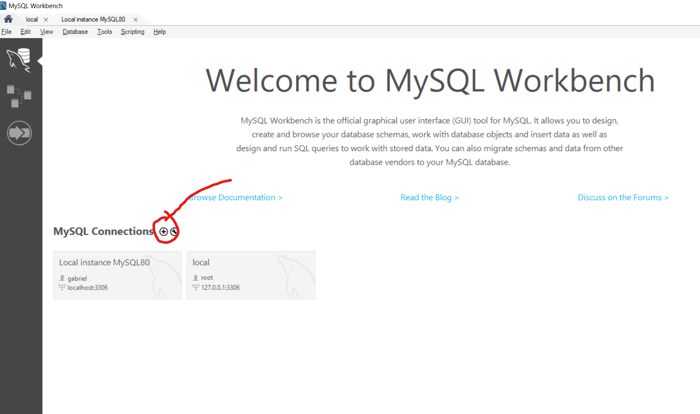
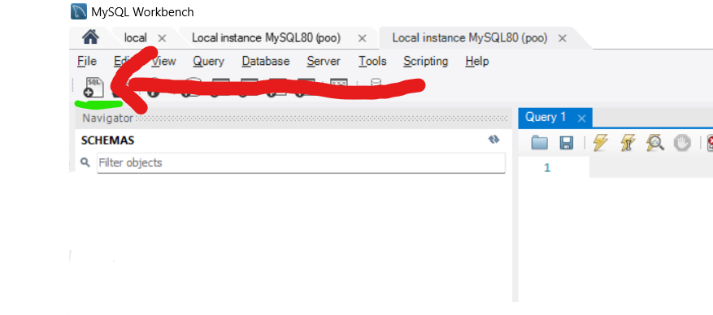

# Aplicação WEB ByteBurgers

## Pré-requisitos

Certifique-se de ter os seguintes requisitos instalados antes de executar o código:

- [git](https://git-scm.com/downloads)
- [node 18.18.0](https://nodejs.org/download/release/v18.19.0/)
- [MySql Server + Workbench](https://dev.mysql.com/downloads/workbench/)
  Ao instalar o WorkBench, atente-se para instalar corretamente e configurar as credenciais de acesso do root.

## Passo 1: Git

### 1.1. Configurando o git

Certifique-se de cadastrar seu usuário e email no git da sua máquina
Para verificar se já está cadastrado, execute:

```bash
git config -l
```

Busque os campos 'user.name' e 'user.email'
Caso não encontre, execute os comandos de defincão dessas variaveis globais

```bash
git config --global user.name "Seu usuario"
git config --global user.email "Seu email"
```

Agora execute o comando de verificação para observar se foi alterado.

### 1.2. Clone o repositório

```bash
git clone https://github.com/GBRodrgues/ByteBurguer.git
```

### 1.3. Rotina de desenvolvimento

Lembrem-se de sempre executarem as modificações sempre na branc 'dev'.
Para isso, navege até a página do projeto e mude a sua branch padrão para a dev:

```bash
cd ByteBurguer
git checkout dev
```

Agora apenas **lembre-se** de sempre atualizar o código antes de desenvolver. Para isso execute um

```bash
git fetch #para atualizar as informações de atualizações no código
git pull origin dev #aplicando as mudanças mapeadas online no seu repositório local da branch dev
```

## Passo 2: Instalar Dependências

Navegue até o diretório do projeto e instale as dependências:

```bash
npm install # ou yarn install
npm install ejs@3.1.6
npm install express@4.17.1
npm install nodemon -g
npm install express-session
```

## Passo 3: Configurar banco de dados

No repositório do projeto, possuimos uma pasta chamada /dumps_sql. Você irá abrir o arquivo dela com um editor de texto e irá copiar todo o conteúdo.
Após isso, abra seu MySQL Worckbench e conecte no seu Local host


Insira as credencias de root e vá para a próxima tela.
nessa nova tela, crie um novo arquivo sql./

Com o arquivo SQL criado, cole o código do dump.sql e execute tudo

agora, ainda nessa tela, digite mais uma linha de código para liberar que seu root seja acessado pela biblioteca do node:
**(Lembre-se de altera o 'password' para sua senha)**

```sql
ALTER USER 'root'@'localhost' IDENTIFIED WITH mysql_native_password BY 'password';

Commit; #para salvar as modificações
```

No repositório, possuímos o arquivo json `connections_template.json`. Copie ele, e sem apagar a versão original, renomeie a cópia para `connections.json`. Dessa forma, iremos manter as credencias dos bancos mais seguras já que o arquivo sem o "template" não irá ser compartilhado pelo git.
Altere as credenciais no arquivo json.

## Passo 3: Executar o Código

Execute o código principal:

```bash
npm start # ou yarn start
```

## Passo 4: Acessar pelo navegador as rotas

- [Página de Login](localhost:8080) - localhost:8080
- [Página Principal](localhost:8080/home) - localhost:8080/home
